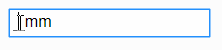

# Readme

> Input Mask bebas berbasis React



## Pemasangan

```bash
# menggunakan yarn
yarn add react-freemask

# atau dengan menggunakan npm
npm i react-freemask
```

## Penggunaan

### Impor

```jsx
import FreeMask from 'react-freemask';
import 'react-freemask/build/css/react-freemask.min.css';
```

### Render

```jsx
<FreeMask segments={['?size', 'mm']} />

// '?size' artinya isian bebas dengan nama size
// 'mm' artinya teks statis biasa
```

Penggunaan isian bebas dengan awalan `?` bisa digunakan lebih dari satu.

```jsx
<FreeMask segments={['?width', 'x', '?height']} />
```

### Tema

Secara bawaan, tidak ada tema khusus yang digunakan. Berikut beberapa tema minimalis yang bisa digunakan:

#### Bootstrap

```jsx
// impor tema
import 'react-freemask/build/css/react-freemask.bootstrap.min.css';

// penggunaan
<FreeMask theme="bootstrap" ... />
```

#### Material

```jsx
// impor tema
import 'react-freemask/build/css/react-freemask.material.min.css';

// penggunaan
<FreeMask theme="material" ... />
```

---

Tentu saja kita bisa menggunakan file `css` tersendiri untuk injeksi style pada komponen, dengan mengimpornya seperti contoh di atas.

## Props

| name     |       type       |       option        | isRequired |
| -------- | :--------------: | :-----------------: | :--------: |
| segments |      array       |          -          |    true    |
| value    |      object      |          -          |   false    |
| theme    |      string      | bootstrap, material |   false    |
| onChange | function (value) |          -          |   false    |

`FreeMask` adalah komponen berbasis `<div>`, sehingga dapat diinjeksikan `props` tambahan, misalnya `style`.
